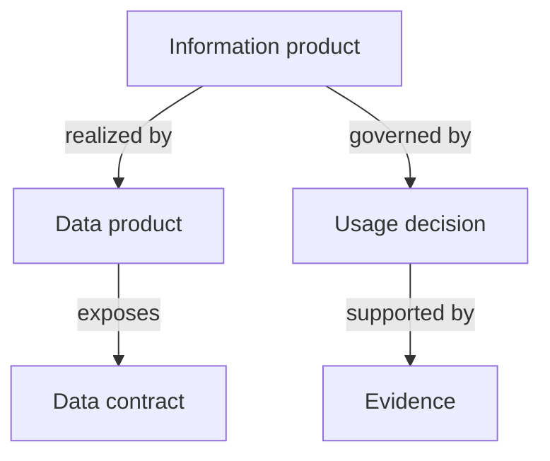

# Information product and realization model

Status: experimental design hypothesis, not an adopted standard or legal interpretation.

## Problem

The initial public-sector profile starts with a technical `DataProduct`. Swedish
public-sector governance meaning may need to attach one abstraction layer above
an API, table, file or stream. This model investigates whether a governed
information product can hold stable purpose, semantics and accountability while
one or more technical data products implement it.

## Proposed concepts

| Concept | Proposed meaning | Deliberate boundary |
|---|---|---|
| Information product | Governed, context-bound and technology-independent information asset | Does not prescribe storage, API or platform |
| Data product | Technically consumable realization of an information product | Does not replace the information-level purpose or accountability |
| Data contract | Technical and operational agreement for an interface | Versioned independently from semantic meaning |
| Usage decision | Attributable decision about a stated purpose in a stated context | Is not an unexplained `allowed` flag or proof of legal compliance |
| Evidence | Reference supporting a decision, assertion or evaluation | A reference does not by itself prove control effectiveness |

## Proposed relationships

- An information product is realized by one or more data products.
- A data product may expose one or more interfaces governed by data contracts.
- Usage decisions apply to a named purpose and record authority, validity and
  optional evidence.
- Semantics belong primarily to the information product. A realization may add
  interface-specific structure without silently redefining the governed meaning.
- Lineage describes technical movement and transformation. Provenance may also
  describe actors, activities, decisions and evidence. They must not be treated
  as synonyms.

## Context, purpose and policy

A governance decision should be reviewable and attributable. The experimental
profile therefore represents at least:

- intended purpose;
- decision: permitted, prohibited, conditional or not assessed;
- decision reference and decision maker;
- validity and review dates;
- rationale and evidence references.

The model does not claim that these fields are sufficient for a legally valid
decision. Applicability, terminology and evidence requirements remain research
and domain-review questions.

## Version identities

Three identities are separated:

1. semantic version of the information product;
2. contract version of a technical interface;
3. dataset, release or snapshot identity for reproducibility.

See [ADR 0002](../adr/0002-separate-semantic-contract-and-snapshot-versioning.md).

## Design hypotheses to evaluate

1. Experts can distinguish an information product from a data product, dataset,
   information asset and records aggregation using the proposed boundaries.
2. Stable governance meaning can be reused across multiple technical
   realizations without semantic contradiction.
3. Attributable usage decisions are more auditable than unqualified boolean
   permission flags.
4. Separate semantic, contract and snapshot identities improve traceability and
   reproducibility without creating unacceptable maintenance overhead.

## Evaluation questions

- Which properties belong to the information product and which to a realization?
- Is the proposed one-to-many relationship valid in realistic public-sector cases?
- Can ODPS, ODCS and DCAT-AP-SE mappings preserve meaning without duplication?
- Which archival, records-management and provenance concepts are missing?
- Can reviewers trace every decision to its authority, applicability and evidence?

The included schema and example are executable probes for these questions. They
are not a settled target model.

